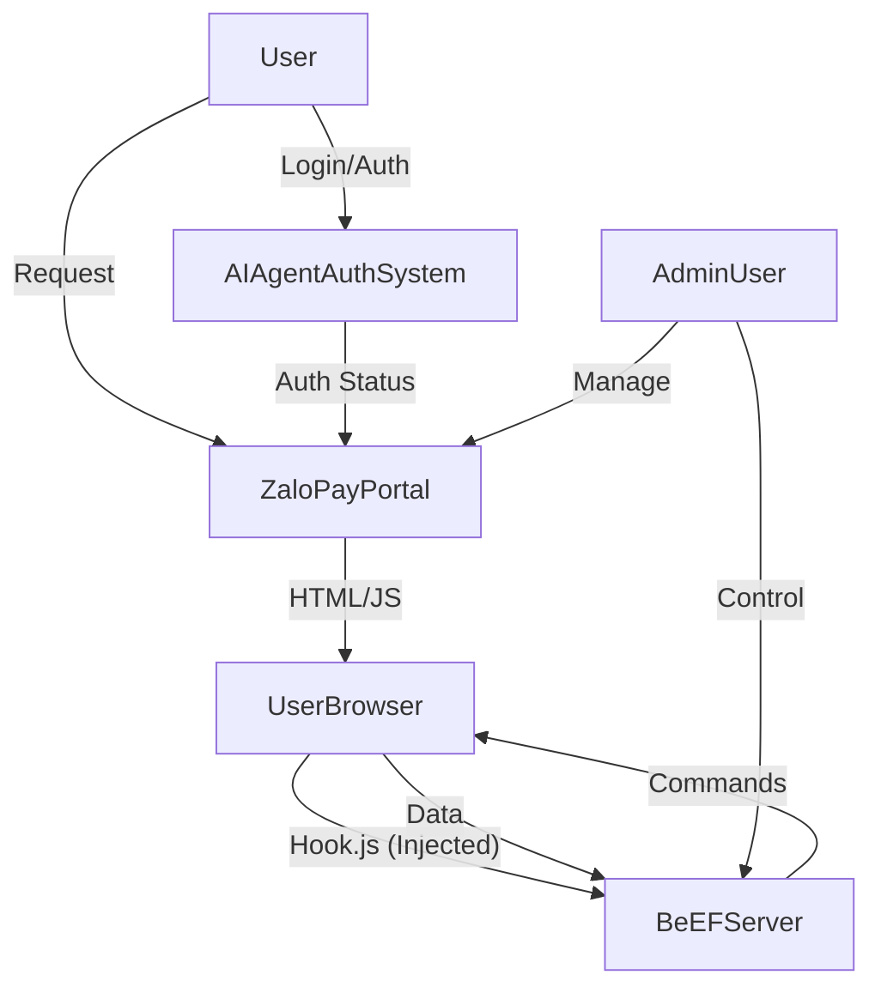

# Thiết kế Kiến trúc Tổng thể Dự án Tích hợp BeEF-ZaloPay Portal với AI Agent Authentication

**Tác giả:** Manus AI
**Ngày:** 03/08/2025

## 1. Giới thiệu

 Tài liệu này phác thảo kiến trúc tổng thể cho dự án tích hợp BeEF (Browser Exploitation Framework) với ZaloPay Portal và hệ thống AI Agent Authentication. Mục tiêu chính của dự án là tạo ra một môi trường thử nghiệm bảo mật thực tế, cho phép triển khai các cuộc tấn công trình duyệt để minh họa và giảng dạy cho sinh viên. Dự án sẽ tập trung vào việc tối ưu hóa ZaloPay Portal và AI Agent Authentication hiện có, đồng thời tích hợp 20 tính năng mạnh mẽ nhất của BeEF để luôn sẵn sàng chờ lệnh triển khai.

## 2. Mục tiêu của Kiến trúc Mới

*   **Tích hợp BeEF liền mạch:** Đảm bảo BeEF chạy ngầm và có thể tương tác hiệu quả với ZaloPay Portal mà không ảnh hưởng đến hoạt động chính của ứng dụng.
*   **Thử nghiệm bảo mật thực tế:** Cung cấp một nền tảng cho phép thực hiện các kịch bản tấn công trình duyệt đa dạng và phức tạp.
*   **Khả năng mở rộng và dễ bảo trì:** Thiết kế kiến trúc cho phép dễ dàng thêm các tính năng BeEF mới hoặc cập nhật các thành phần hiện có.
*   **Tối ưu hóa hiệu suất:** Đảm bảo ZaloPay Portal và AI Agent Authentication vẫn hoạt động mượt mà và hiệu quả.
*   **Tính toàn diện và hiện đại:** Tích hợp 20 tính năng BeEF được chọn lọc, đại diện cho các kỹ thuật tấn công trình duyệt tiên tiến nhất.

## 3. Kiến trúc Tổng thể

Kiến trúc mới sẽ bao gồm ba thành phần chính tương tác với nhau:

1.  **ZaloPay Portal:** Ứng dụng web chính, đóng vai trò là mục tiêu của các cuộc tấn công BeEF.
2.  **AI Agent Authentication System:** Hệ thống xác thực người dùng, sẽ được tối ưu hóa và hoạt động song song với BeEF.
3.  **BeEF (Browser Exploitation Framework):** Chạy ngầm, theo dõi và khai thác các trình duyệt truy cập ZaloPay Portal.

### 3.1. Sơ đồ Kiến trúc Cấp cao

**Giải thích:**

*   Người dùng (User) truy cập ZaloPay Portal.
*   ZaloPay Portal trả về HTML/JS cho trình duyệt của người dùng (UserBrowser).
*   Một đoạn mã JavaScript (hook.js) từ BeEF Server sẽ được tiêm (injected) vào trình duyệt của người dùng.
*   Khi người dùng đăng nhập hoặc thực hiện các hành động xác thực, AI Agent Authentication System sẽ xử lý.
*   BeEF Server sẽ nhận được thông tin từ trình duyệt đã bị hook và có thể gửi các lệnh tấn công ngược lại trình duyệt đó.
*   Quản trị viên (AdminUser) có thể điều khiển BeEF Server để triển khai các module tấn công và quản lý ZaloPay Portal.

## 4. Các Thành phần Chính và Luồng Dữ liệu

### 4.1. ZaloPay Portal

*   **Mô tả:** Ứng dụng web Flask hiện có, cung cấp giao diện merchant, hệ thống đăng ký đối tác, dashboard quản trị viên, v.v.
*   **Thay đổi/Tối ưu hóa:**
    *   Đảm bảo khả năng tiêm BeEF hook.js vào mọi trang HTML được trả về.
    *   Tối ưu hóa hiệu suất và bảo mật tổng thể của ứng dụng.
    *   Giữ nguyên các tính năng cốt lõi đã có.
*   **Luồng dữ liệu:**
    *   Nhận yêu cầu HTTP từ UserBrowser.
    *   Trả về HTML, CSS, JavaScript.
    *   Tương tác với cơ sở dữ liệu (ZaloPay DB) để lưu trữ và truy xuất dữ liệu người dùng, đối tác, giao dịch.
    *   Gửi yêu cầu xác thực đến AI Agent Authentication System.

### 4.2. AI Agent Authentication System

*   **Mô tả:** Hệ thống xác thực người dùng hiện có, sẽ được tối ưu hóa.
*   **Thay đổi/Tối ưu hóa:**
    *   Đảm bảo tính ổn định và bảo mật của quá trình xác thực.
    *   Tối ưu hóa trải nghiệm người dùng trong quá trình xác thực.
    *   Không thay đổi logic xác thực cốt lõi, chỉ tập trung vào tối ưu hóa.
*   **Luồng dữ liệu:**
    *   Nhận yêu cầu xác thực từ ZaloPay Portal.
    *   Xử lý logic xác thực (ví dụ: kiểm tra thông tin đăng nhập, xác thực đa yếu tố).
    *   Trả về trạng thái xác thực (thành công/thất bại) cho ZaloPay Portal.

### 4.3. BeEF (Browser Exploitation Framework)

*   **Mô tả:** BeEF Python sẽ chạy ngầm như một dịch vụ độc lập, lắng nghe các kết nối từ các trình duyệt đã bị hook.
*   **Thay đổi/Tối ưu hóa:**
    *   **Chạy ngầm:** Đảm bảo BeEF server khởi động tự động cùng với ứng dụng ZaloPay Portal và chạy trong background.
    *   **Tích hợp hook:** Cơ chế tiêm `hook.js` vào tất cả các trang HTML của ZaloPay Portal sẽ được kiểm tra và củng cố.
    *   **20 tính năng BeEF:** Tập trung vào việc kích hoạt và quản lý 20 tính năng đã chọn. Các tính năng này sẽ được phân loại và tổ chức để dễ dàng triển khai và theo dõi.
*   **Luồng dữ liệu:**
    *   Nhận kết nối từ `hook.js` trong UserBrowser.
    *   Thu thập thông tin từ UserBrowser (ví dụ: thông tin hệ thống, cookie, lịch sử duyệt web).
    *   Gửi các lệnh tấn công (command modules) đến UserBrowser.
    *   Nhận kết quả thực thi lệnh từ UserBrowser.
    *   Lưu trữ dữ liệu thu thập được và kết quả tấn công vào cơ sở dữ liệu của BeEF.

## 5. Cơ sở dữ liệu

*   **ZaloPay DB:** Cơ sở dữ liệu hiện có của ZaloPay Portal (sqlite:///zalopay_portal.db), chứa thông tin người dùng, đối tác, giao dịch, v.v. Sẽ không có thay đổi lớn về lược đồ, chỉ tối ưu hóa nếu cần.
*   **BeEF DB:** BeEF Python sẽ sử dụng cơ sở dữ liệu riêng của nó (thường là SQLite mặc định) để lưu trữ thông tin về các trình duyệt bị hook, kết quả thực thi lệnh, và các dữ liệu liên quan đến tấn công. Hai cơ sở dữ liệu này sẽ hoạt động độc lập nhưng có thể được truy cập bởi các thành phần tương ứng.

## 6. Kế hoạch Tích hợp 20 Tính năng BeEF

Các tính năng BeEF đã chọn sẽ được tích hợp theo từng nhóm chức năng:

### 6.1. Thu thập thông tin (Information Gathering)

*   **Browser Fingerprinting:** Thu thập thông tin chi tiết về trình duyệt (user-agent, plugin, font, screen resolution, v.v.).
*   **Get Visited Domains:** Lấy danh sách các domain đã truy cập từ lịch sử trình duyệt.
*   **Get Cookie:** Trích xuất cookie từ trình duyệt của nạn nhân.
*   **Get Local Storage:** Trích xuất dữ liệu từ Local Storage của trình duyệt.
*   **Get System Info Java:** Thu thập thông tin hệ thống thông qua Java applet (nếu có).

### 6.2. Khai thác và tương tác phía Client (Client-Side Exploitation & Interaction)

*   **Deface Web Page:** Thay đổi nội dung hiển thị của trang web trên trình duyệt nạn nhân.
*   **Redirect Browser:** Chuyển hướng trình duyệt nạn nhân đến một URL khác.
*   **Create Alert Dialog:** Hiển thị hộp thoại cảnh báo tùy chỉnh trên trình duyệt nạn nhân.
*   **Raw Javascript:** Thực thi mã JavaScript tùy ý trên trình duyệt nạn nhân.
*   **Webcam:** Truy cập và chụp ảnh từ webcam của nạn nhân (yêu cầu quyền của người dùng).
*   **Screenshot (Chrome Extensions):** Chụp ảnh màn hình trình duyệt thông qua extension (nếu có).
*   **Get Clipboard:** Lấy nội dung từ clipboard của nạn nhân.

### 6.3. Kỹ thuật Social Engineering

*   **Fake Flash Update:** Hiển thị thông báo giả mạo yêu cầu cập nhật Flash để lừa nạn nhân tải xuống phần mềm độc hại.
*   **Google Phishing:** Tạo trang đăng nhập Google giả mạo để thu thập thông tin đăng nhập.
*   **Pretty Theft:** Hiển thị hộp thoại giả mạo để lừa nạn nhân nhập thông tin nhạy cảm (ví dụ: mật khẩu).
*   **Fake Notification Bar (Chrome):** Tạo thanh thông báo giả mạo trên trình duyệt Chrome để lừa nạn nhân.
*   **Clickjacking:** Lừa nạn nhân click vào các phần tử ẩn trên trang web.

### 6.4. Duy trì truy cập & Nâng cao (Persistence & Advanced)

*   **Man-In-The-Browser:** Duy trì quyền kiểm soát trình duyệt của nạn nhân.
*   **Local File Theft:** Cố gắng đọc và trích xuất các tệp cục bộ từ hệ thống của nạn nhân (yêu cầu lỗ hổng trình duyệt).
*   **Port Scanner (Network):** Thực hiện quét cổng từ trình duyệt của nạn nhân để phát hiện các dịch vụ mở trên mạng nội bộ.

## 7. Luồng hoạt động của hệ thống tích hợp

1.  **Khởi động:** Khi ứng dụng ZaloPay Portal được khởi động, BeEF server sẽ tự động chạy ngầm.
2.  **Hook trình duyệt:** Khi người dùng truy cập bất kỳ trang nào trên ZaloPay Portal, đoạn mã `hook.js` của BeEF sẽ được tiêm vào trình duyệt của họ. Trình duyệt này sau đó sẽ trở thành một 

 'zombie browser' dưới sự kiểm soát của BeEF.
3.  **Xác thực AI Agent:** Khi người dùng cố gắng đăng nhập hoặc thực hiện các hành động yêu cầu xác thực trên ZaloPay Portal, AI Agent Authentication System sẽ xử lý. Quá trình này diễn ra độc lập với BeEF nhưng vẫn nằm trong ngữ cảnh của trình duyệt đã bị hook.
4.  **Triển khai tấn công:** Quản trị viên (người dùng) có thể truy cập bảng điều khiển BeEF (BeEF UI) và chọn các module tấn công từ 20 tính năng đã được tích hợp để thực thi trên các trình duyệt đã bị hook. Các lệnh này sẽ được gửi từ BeEF Server đến trình duyệt thông qua `hook.js`.
5.  **Thu thập và phân tích dữ liệu:** BeEF sẽ thu thập thông tin từ trình duyệt bị hook (ví dụ: cookie, lịch sử duyệt web, thông tin hệ thống) và gửi về BeEF Server. Dữ liệu này có thể được sử dụng để phân tích và lên kế hoạch cho các cuộc tấn công tiếp theo.
6.  **Báo cáo và minh họa:** Kết quả của các cuộc tấn công và dữ liệu thu thập được sẽ được hiển thị trên bảng điều khiển BeEF, cho phép người dùng (giảng viên) minh họa các lỗ hổng bảo mật và kỹ thuật tấn công cho sinh viên.

## 8. Các cân nhắc về Bảo mật

*   **Môi trường thử nghiệm:** Dự án này được thiết kế cho mục đích thử nghiệm và giảng dạy. Việc triển khai trong môi trường sản phẩm thực tế cần được xem xét kỹ lưỡng và tuân thủ các quy định pháp luật về an toàn thông tin.
*   **Phân quyền:** Đảm bảo rằng chỉ những người dùng có quyền mới có thể truy cập và điều khiển BeEF Server.
*   **Tách biệt dữ liệu:** Dữ liệu của ZaloPay Portal và BeEF sẽ được lưu trữ trong các cơ sở dữ liệu riêng biệt để tránh ảnh hưởng lẫn nhau.
*   **Cập nhật và vá lỗi:** Thường xuyên cập nhật các thành phần của hệ thống (Flask, BeEF, thư viện Python) để đảm bảo an toàn trước các lỗ hổng mới.

## 9. Kết luận

Kiến trúc được đề xuất này cung cấp một lộ trình rõ ràng để tích hợp BeEF vào ZaloPay Portal và AI Agent Authentication System, tạo ra một nền tảng mạnh mẽ cho việc thử nghiệm và giảng dạy bảo mật trình duyệt. Bằng cách tập trung vào 20 tính năng BeEF tiên tiến và đảm bảo hoạt động ngầm, dự án sẽ đáp ứng được yêu cầu của người dùng về một môi trường tấn công thực tế và toàn diện.

## 10. Tài liệu tham khảo

*   [BeEF Project Official Website](https://beefproject.com/)
*   [BeEF GitHub Wiki](https://github.com/beefproject/beef/wiki)
*   [Flask Documentation](https://flask.palletsprojects.com/)
*   [SQLAlchemy Documentation](https://docs.sqlalchemy.org/)

